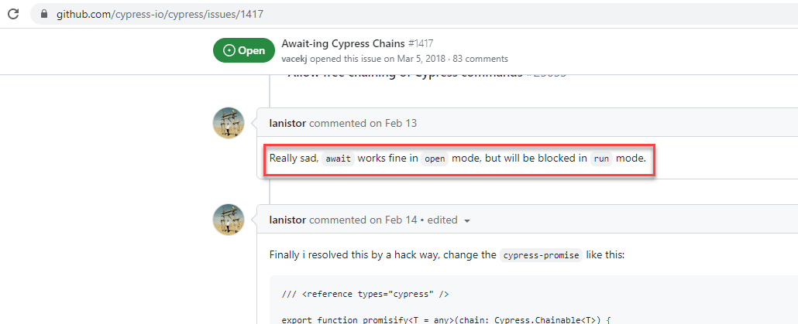

This is the automation framework used by QA engineers and developers.
It means both QA engineers and developers can develop, maintain, and troubleshooting any failure.

This automation framework is used for automating both internal and external web applications, so we come up with POM pattern (not Application Actions pattern).

Please spend time reading the [Best Practice](https://docs.cypress.io/guides/references/best-practices)
before working.

# [Organizing tests](https://docs.cypress.io/guides/core-concepts/writing-and-organizing-tests)
### Fixtures files
Fixtures are used as external pieces of static data that can be used by your tests.
You would typically use them with the cy.fixture() command, and most often when you're stubbing Network Requests.

### Plugins file
The plugins file is a special file that executes in Node before the project is loaded, before the browser launches, and during your test execution.

### Support file
By default, Cypress will automatically include the support file cypress/support/e2e.js. This file runs before every single spec file.
We do this purely as a convenience mechanism, so you don't have to import this file in every single one of your spec files.

# Getting started
+ Install dependencies

    `npm install`

+ Run test manually

    `npm run cy:open`

+ Run test automatically

    `npm run cy:run`

+ Run test automatically and then open with Allure report

    `npm run cy:clean-run-report`

+ Run Cypress run with specific spec, headed mode, don't quite the browser

    `npx cypress run --browser chrome --env configFile=qat --spec "cypress/e2e/todo.feature" --headed --no-exit`

# Parallel execution
Cypress has a Cypress Cloud service playing as a centralization reporting, and distributed running.
There are some inconvenient things that we decided not to use the Cypress Cloud:
1. The Cypress Cloud is a paid service
2. The Cypress Cloud test result does not show correctly the Cucumber steps

Hence, we use the cypress-parallel lib to run the automated suites in a test machine.

# Test execution extension
Parallel running: from the root folder of the repo, the test folder itself has a package.json separately with
the app source code. The following command is running the test with

+ 4: concurrent threads
+ env: UAT
+ browser: Chrome

  ```
  cd test
  npm install
  node_modules/.bin/cypress-parallel -v -s cy:runp -t 4 -m false --delayThreads 180 -d 'cypress/e2e/**/!(_helpers|draft)/!(test).feature' --weightsJson cypress/parallel-weights.json -n node_modules/cypress-multi-reporters -a '"--browser chrome --env configFile=qat"'
  ```

# Test result checking
When you see tests failed, we should do the following steps to analyze they are due to the scripts, or the application under test:
1. Check the screenshot attached under the failed test
2. If the screenshot does not give much information, try to run only the failed test again in the debug mode
3. At this step you know what causes the test failed

# VSCode plugins
- [Cucumber (Gherkin) Full Support](https://marketplace.visualstudio.com/items?itemName=alexkrechik.cucumberautocomplete)
- [Cypress Helper](https://marketplace.visualstudio.com/items?itemName=Shelex.vscode-cy-helper)

# Cypress issues
1. [Cypress hangs during execution of test suite](https://github.com/cypress-io/cypress/issues/6695)
2. [Click and type events in after or afterEach hook don't work if one test fails](https://github.com/cypress-io/cypress/issues/2831)
3. [Cypress Doesn't Fail Test on Range of Unhandled Exceptions](https://github.com/cypress-io/cypress/issues/2487)
4. [Https and http switching](https://docs.cypress.io/guides/guides/web-security#:~:text=Because%20of%20the%20way%20Cypress,back%20to%20an%20HTTP%20site.)
5. Test step not failed due to async function
  + [Await-ing Cypress Chains](https://github.com/cypress-io/cypress/issues/1417)

  

  + [Support async test functions](https://github.com/cypress-io/cypress/issues/25832)

  + [Assertion failure in async test case does not fail test overall](https://github.com/cypress-io/cypress/issues/4742)
6. [Failure test cases are missing in the Allure report](https://github.com/Shelex/cypress-allure-plugin/issues/205)
